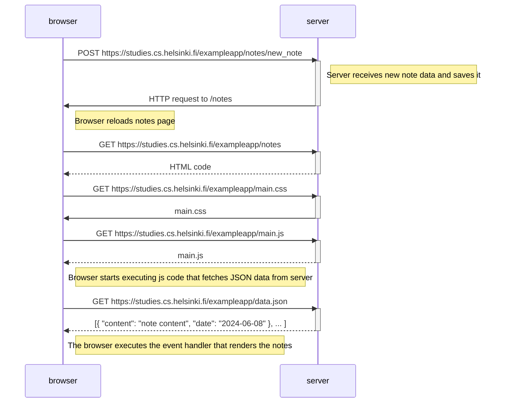

```mermaid

sequenceDiagram
    participant browser
    participant server

    browser->>server: POST https://studies.cs.helsinki.fi/exampleapp/notes/new_note 
    activate server
    Note right of server: Server receives new note data and saves it
    server->>browser: HTTP request to /notes
    deactivate server

    Note right of browser: Browser reloads notes page

    browser->>server: GET https://studies.cs.helsinki.fi/exampleapp/notes
    activate server
    server-->>browser: HTML code
    deactivate server

    browser->>server: GET https://studies.cs.helsinki.fi/exampleapp/main.css
    activate server
    server->>browser: main.css
    deactivate server

    browser->> server: GET https://studies.cs.helsinki.fi/exampleapp/main.js
    activate server
    server-->>browser: main.js
    deactivate server

    Note right of browser: Browser starts executing js code that fetches JSON data from server

    browser->>server: GET https://studies.cs.helsinki.fi/exampleapp/data.json
    activate server
    server-->>browser: [{ "content": "note content", "date": "2024-06-08" }, ... ]
    deactivate server

    Note right of browser: The browser executes the event handler that renders the notes

```