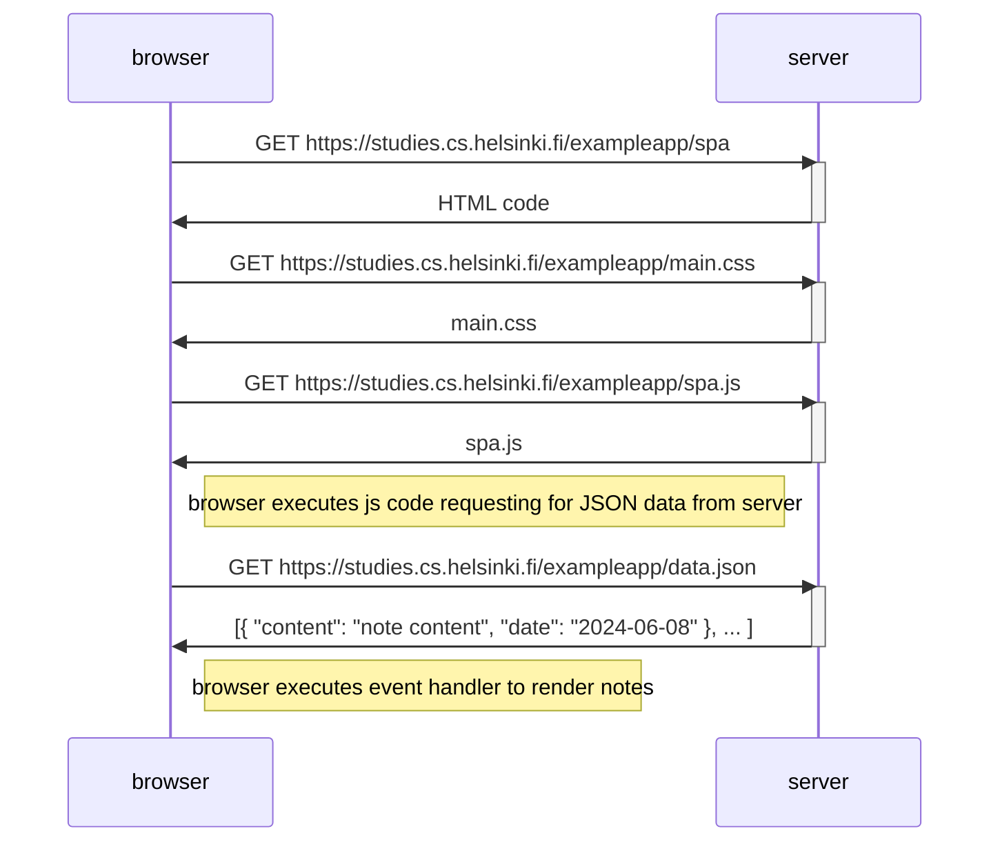

```mermaid

sequenceDiagram
    participant browser
    participant server

    browser->>server: GET https://studies.cs.helsinki.fi/exampleapp/spa 
    activate server
    server->>browser: HTML code
    deactivate server

    browser->>server: GET https://studies.cs.helsinki.fi/exampleapp/main.css
    activate server
    server->>browser: main.css
    deactivate server

    browser->>server: GET https://studies.cs.helsinki.fi/exampleapp/spa.js
    activate server
    server->>browser: spa.js
    deactivate server
    Note right of browser: browser executes js code requesting for JSON data from server

    browser->>server: GET https://studies.cs.helsinki.fi/exampleapp/data.json
    activate server
    server->>browser: [{ "content": "note content", "date": "2024-06-08" }, ... ]
    deactivate server
    Note right of browser: browser executes event handler to render notes

```
